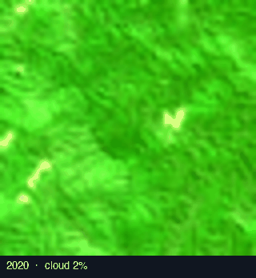
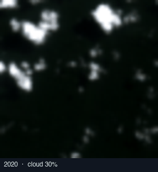
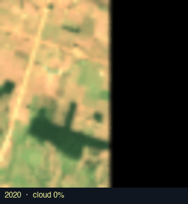
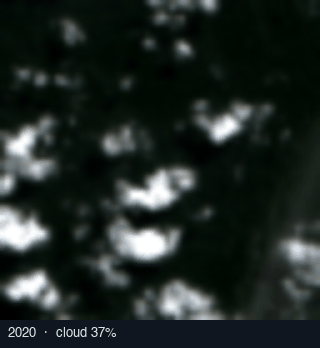
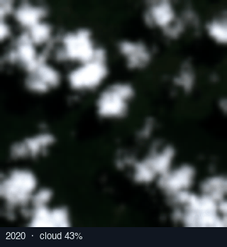
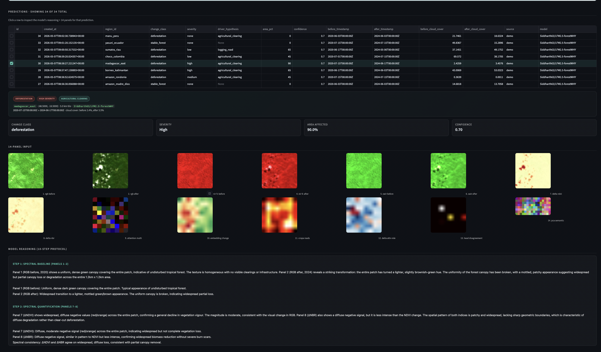
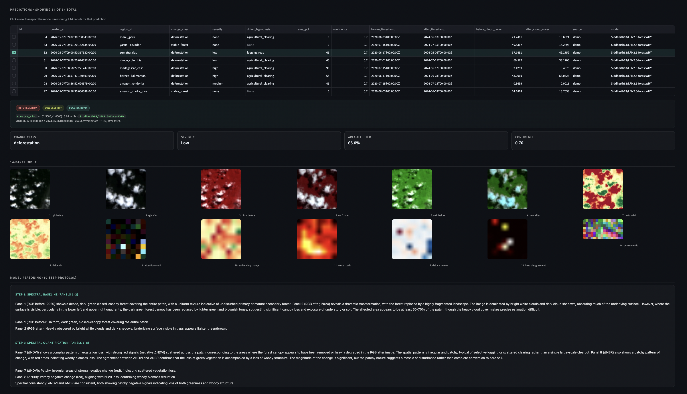
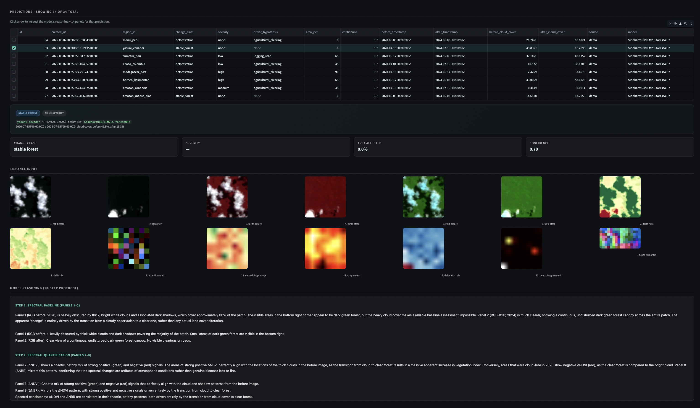

# forestWHY — On-orbit Deforestation Detection with LFM2.5-VL

> Liquid AI hackathon **LFM track** submission. Built around SimSat
> Sentinel-2 imagery, a Sentinel-2 I-JEPA encoder, and a fine-tuned
> [`Siddharth63/LFM2.5-forestWHY`](https://huggingface.co/Siddharth63/LFM2.5-forestWHY)
> trained on the private curated set `Siddharth63/forestwhy-combined-v1`
> and evaluated **out-of-distribution** against the public
> [`Siddharth63/forestwhy-training-v2`](https://huggingface.co/datasets/Siddharth63/forestwhy-training-v2).

### Quick visual demo

> 14-panel temporal pair (Sentinel-2, 5 km tile, 2020 → 2024) →
> LFM2.5-forestWHY 10-step reasoning → driver-attributed deforestation report.

Top-5 hand-picked demos from a 10-location SimSat backfill (2020 → 2024).
All five model-correct calls, ranked by area × class × confidence − cloud
penalty.

<table>
  <tr>
    <td align="center"><br><sub><b>Madagascar east</b><br>tavy slash-and-burn · <b>high</b><br>~90 % area · cloud 2/3 %</sub></td>
    <td align="center"><br><sub><b>Congo Equateur</b><br>shifting cultivation · <b>high</b><br>~90 % area</sub></td>
    <td align="center"><br><sub><b>Rondônia, Brazil</b><br>fishbone settlement · <b>medium</b><br>~45 % area · cloud 0/0 %</sub></td>
  </tr>
  <tr>
    <td align="center"><br><sub><b>Sumatra Riau</b><br>peatland pulp plantations · <b>low</b><br>~65 % area</sub></td>
    <td align="center"><br><sub><b>Central Kalimantan</b><br>oil-palm plantation · <b>high</b><br>~65 % area</sub></td>
    <td align="center" valign="middle"><sub>↻ Reproduce all five with<br><code>uv run python scripts/demo_backfill.py</code><br><code>uv run python scripts/make_demo_gifs.py</code><br>≈ 7 min on Apple Silicon Metal.</sub></td>
  </tr>
</table>

<p align="center">
  <br>
  <sub>Dashboard inspector on a Madagascar east tile — model says <b>deforestation</b>,
  severity <b>high</b>, ~90 % area affected, driver <code>agricultural_clearing</code>.
  All 14 panels (8 spectral + 6 JEPA differentials) plus the 10-step
  reasoning chain are visible in one view.</sub>
</p>

<p align="center">
   &nbsp;
  <br>
  <sub>The same inspector on two contrasting tiles —
  <b>left:</b> a low-severity deforestation case (~35 % area, model still confident);
  <b>right:</b> a stable-forest contrast from a protected primary-forest area
  (the model correctly says no change). The badge palette and metric cards
  let a judge tell at a glance which class the model picked.</sub>
</p>

### Why this matters now

The **EU Deforestation Regulation (EUDR)** comes into force on
**30 December 2025** for large operators — every shipment of soy, palm
oil, beef, cocoa, coffee, rubber, or wood entering the EU must come with a
plot-level due-diligence statement showing the land was not deforested
after Dec 2020. Non-compliance fines: up to 4 % of EU turnover.
At the same time, the voluntary carbon market took **$1–2 B in
mark-downs** during 2023–24 over verification failures (Verra REDD+
re-baselines, Pachama buffer-pool reversals). Both buyers — compliance
officers and carbon verifiers — need **driver-attributed, audit-ready,
plot-scale alerts** at a price below the €0.50–2/ha/year incumbents
charge. forestWHY is the reasoning layer that produces those alerts.

### What it does

forestWHY does what a single-frame remote-sensing model can't: it **reasons
over a temporal pair** of Sentinel-2 acquisitions and tells you not only
that something changed, but *what kind of change*, *what's driving it*, and
*why a human should believe the answer*.

The pipeline takes a before/after pair (≈ 1 year apart, 13 bands, 5 km
tile) and turns it into 14 input panels for a vision-language model:

- **8 spectral panels** — RGB, NIR-FC, SWIR before/after plus ΔNDVI and
  ΔNBR — answer *"how big is the pixel-level signal?"*
- **6 JEPA panels** — multi-scale attention, embedding cosine distance,
  cross-patch correlation, attention-role delta, head disagreement, PCA
  cluster split — answer *"did the scene's semantic class actually flip,
  or are we just looking at cloud shadow / phenology / haze?"*

Spectral alone is fooled by all the things spectral indices have always
been fooled by. JEPA differentials alone tell you *something* changed but
not *what*. Together — fed to **LFM2.5-forestWHY**, a 2 B fine-tune of
LFM2-VL trained on 150 K labelled Sentinel-2 pairs — the model can read
both kinds of evidence in one pass and produce a structured deforestation
report with a 10-step reasoning chain. That report is small enough (≈ 1 KB)
to ship as JSON, opening the door to on-orbit inference where the raw
imagery would never be downlinked.

This is a workflow that neither satellite imagery alone (no temporal
reasoning, no driver attribution) nor a generic VLM alone (can't read
spectral or JEPA panels) can produce. See [ARCHITECTURE.md](ARCHITECTURE.md)
for the design rationale and [ARCHITECTURE.md#who-this-serves-and-what-they-pay-today](ARCHITECTURE.md#who-this-serves-and-what-they-pay-today)
for the customer/product story.

## Documentation

- [**QUICKSTART.md**](QUICKSTART.md) — step-by-step instructions to install
  and run, including a fully local end-to-end smoke test that needs **no
  GPU and no SimSat** (just `uv sync` + `brew install llama.cpp`).
- [**ARCHITECTURE.md**](ARCHITECTURE.md) — design rationale, why the
  14-panel approach beats spectral-only and generic VLMs, what is
  genuinely innovative, and the evaluation methodology.

## Hosted artefacts

| Artefact                                | Where                                                                                                |
|-----------------------------------------|------------------------------------------------------------------------------------------------------|
| Source                                  | https://github.com/siddharth0112358/forestWHY-hackathon-submission                                   |
| Sentinel-2 I-JEPA ViT-L/8 encoder (1.21 GB) | https://huggingface.co/Siddharth63/forestWHY-JEPA-vitl                                           |
| Fine-tuned VLM (full precision)         | https://huggingface.co/Siddharth63/LFM2.5-forestWHY                                                   |
| Fine-tuned VLM (GGUF Q4_K_M / Q5_K_M / Q8_0) | https://huggingface.co/Siddharth63/LFM2.5-forestWHY-GGUF                                         |
| Training dataset (private, curated) | `Siddharth63/forestwhy-combined-v1` (private — gated access)                                              |
| Public eval dataset (≈ 150 K Sentinel-2 pairs) | https://huggingface.co/datasets/Siddharth63/forestwhy-training-v2                                |
| Base for comparison (1.6B params)       | https://huggingface.co/LiquidAI/LFM2.5-VL-1.6B                                                        |

## Repository layout

```
.
├── README.md                          # this file
├── QUICKSTART.md                      # how to run, step-by-step
├── ARCHITECTURE.md                    # design rationale + innovation
├── pyproject.toml                     # uv-managed Python deps
├── uv.lock                            # locked dependency graph
├── .env.example                       # all environment variables documented
├── .gitignore
│
├── app/
│   ├── app.py                         # Streamlit dashboard: pydeck map + 14-panel viewer
│   └── eval_compare.py                # base vs fine-tuned side-by-side comparator
│
├── assets/                            # diagrams, screenshots, demo GIFs
│
├── configs/
│   └── forestwhy_finetune_modal.yaml  # leap-finetune Modal H100 config
│
├── scripts/
│   ├── predict.py                     # main watch loop (--smoke-test or live SimSat)
│   ├── backfill.py                    # historical (location, before, after) iteration
│   ├── download_weights.py            # pre-warm HF cache (JEPA + VLM)
│   ├── upload_jepa.py                 # one-off: push the encoder .pt to HF Hub
│   ├── generate_samples.py            # eval-set labeller (uses Anthropic for ground truth)
│   ├── check_samples.py               # validate generated samples conform to schema
│   ├── evaluate.py                    # base vs fine-tuned per-field accuracy
│   ├── prepare_dataset.py             # HF dataset → leap-finetune JSONL
│   ├── quantize.py                    # safetensors → GGUF Q4_K_M / Q8_0 + mmproj
│   └── push_gguf_to_hf.py             # upload GGUF pair to HF Hub
│
└── src/forestwhy/
    ├── __init__.py
    ├── db.py                          # SQLite schema + insert/fetch helpers
    ├── live.py                        # SimSat HTTP client (position, 13-band, walkback)
    ├── locations.py                   # 18 watched deforestation hotspots
    ├── regions.py                     # tile geometry (haversine, find_tile)
    ├── spectral.py                    # 8 spectral panel generators
    ├── jepa.py                        # vendored S2Encoder + 6 JEPA panels + HF auto-download
    ├── llama_server.py                # subprocess lifecycle for llama-server + GGUF auto-pull
    ├── pipeline.py                    # tile → 14 panels → VLM → SQLite glue
    ├── prompts.py                     # SYSTEM_PROMPT (training-time verbatim) + dashboard schema
    ├── annotator.py                   # (planned) Anthropic ground-truth labeller helpers
    └── evaluator.py                   # PredictFn protocol + vllm/llamacpp/transformers/stub backends
```

## What's in each top-level directory

- **`app/`** — Streamlit. The map + 14-panel viewer is the demo surface;
  the comparator app is for the fine-tuning evaluation.
- **`scripts/`** — every CLI entry point. `predict.py` is the one judges
  invoke; the rest are operational tooling (eval, dataset prep,
  quantisation, HF upload).
- **`src/forestwhy/`** — the library. Importable as `forestwhy.*`,
  installed as a package by `uv sync`. The two heaviest files are
  `jepa.py` (vendored ViT-L/8 + 6 differential panels) and `pipeline.py`
  (the per-tile glue).
- **`configs/`** — fine-tuning specs only. No runtime config (everything
  else lives in `.env`).

## Want to run it?

Pick the fidelity that matches your environment:

| You have                      | Mode                        | First command                                        |
|-------------------------------|-----------------------------|------------------------------------------------------|
| Just a laptop                 | Stub smoke test             | `uv run python scripts/predict.py --smoke-test`      |
| Laptop + `brew install llama.cpp` | **End-to-end with the real fine-tune** | `uv run python scripts/predict.py --smoke-test --with-gguf` |
| Laptop + Docker + a GPU host  | Full live run               | follow [QUICKSTART.md §3](QUICKSTART.md#mode-3--live-run-against-simsat--a-hosted-vllm) |

See [QUICKSTART.md](QUICKSTART.md) for full instructions, troubleshooting,
and the smoke-test checklist.

## Contact

Built by **Siddharth** — siddharth.deshpande63@gmail.com
Happy to walk through any of this; ping me directly for follow-up.

## License & credits

MIT. Built for the Liquid AI hackathon LFM track. Repository structure
inspired by the upstream
[`Liquid4All/cookbook/examples/wildfire-prevention`](https://github.com/Liquid4All/cookbook/tree/main/examples/wildfire-prevention).
Sentinel-2 imagery © Copernicus / ESA. SimSat by
[DPhi Space](https://github.com/DPhi-Space/SimSat).
